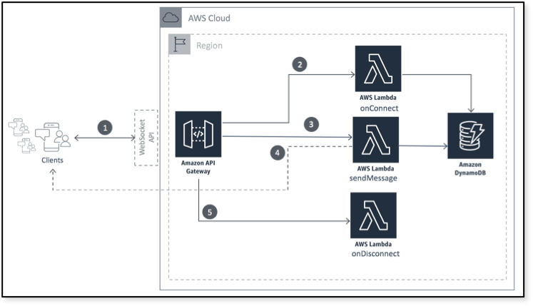

# AWS Mini Projects

A compilation of small aws projects used to illustrate certain concepts.

## Websocket

AWS websocket reference implementation based of the following architecture:


_https://aws.amazon.com/blogs/compute/announcing-websocket-apis-in-amazon-api-gateway/_

### Usage

Usage assumes you already have terraform (v0.12) and awscli (v2.42) setup and you are in the _websocket_ folder.

Execute the following:

```sh
make setup
make package
make run
```

To cleanup everything, run:

```sh
make destroy
```

## Style Guide

Consistency in naming of resources and general organization is key to stimulating pleasure when maintaining a code that has some sort of logical flow and aesthetic appeal.

I have attempted to clamp my style suggestions into the following example:

```hcl
locals {
  path = "./target/bin/on-connect.zip"
}

data "aws_iam_policy_document" "allow_function_to_dynamo_db" {
  statement {
    actions   = ["dynamodb:BatchWriteItem"]
    resources = [var.dynamodb_arn]
  }
}

resource "aws_iam_role_policy" "allow_function_to_dynamo_db" {
  name = "allow-on-connect-to-dynamo-db"
  role = "${aws_iam_role.allow_function.id}"

  policy = data.aws_iam_policy_document.allow_function_to_dynamo_db.json
}

data "aws_iam_policy_document" "allow_function" {
  statement {
    actions = ["sts:AssumeRole"]

    principals {
      type        = "Service"
      identifiers = ["lambda.amazonaws.com"]
    }
  }
}

resource "aws_iam_role" "allow_function" {
  name = "allow-on-connect"

  assume_role_policy = data.aws_iam_policy_document.allow_function.json
}

resource "aws_lambda_function" "function" {
  filename      = local.filename
  function_name = var.name
  role          = "${aws_iam_role.allow_function.arn}"
  handler       = "main"

  source_code_hash = filebase64sha256(local.filename)"

  runtime = "go1.x"
}
```

The following are some principles I have adopted provisioning resource in the cloud with terraform.

1. Use dashes in name of resources created in AWS where possible. They serve as visual delimeters when scrolling through a tall list resources in the UI. For example, `flying-chat-db`.
1. Use the `aws_iam_policy_document` data directive for constructing policies for iam roles. It is consistent with HCL in general and easy to change.
1. Most policies end up being assigned to roles, as much as possible, indicate what permissions are being granted and to what. For example, policy with name `allow_function_to_dynamo_db` is meant to be attached to a role with name `allow_function` and adequately communicates the nature of the permission being granted.
1. Provide the same name for resources that are meant to work together. They should also _live_ together. For example, an `aws_iam_policy` and its `aws_iam_role_policy_attachment` can have the same name `allow_function_to_dynamo_db` and be defined in the same `.tf` file. It makes searching for a group or resources that work together as a component easier.
1. Terraform does not care about the order in which resources are created. However, code is [art](https://www.vogue.com/article/the-120000-art-basel-banana-explained-maurizio-cattelan), I put a premium on [aesthetic appeal](https://www.youtube.com/watch?v=1d3YnvEyRhE). I tend to put resources in some logical order, starting with the resource at the bottom of the _dependency tree_. For example, `aws_iam_policy_document.allow_function_to_dynamo_db` is needed to create `aws_iam_role_policy.allow_function_to_dynamo_db` which is then assigned to `aws_iam_role.allow_function`, however, `aws_iam_policy_document.allow_function` is needed to create `aws_iam_role.allow_function` which is why it appears before the role definition in the example.
1. When you need to use name of region in multi-region resources, be sure to use the short forms. For example, `use1` for `us-east-1`. You could run into name length limits easily, expecially when doing your best to communicate intent in your choice of name.
1. Use the `local` directive as soon as you identify that some string parameter appears more than once in the configuration.
1. Terraform files or components should be given suitable collective names. For example, `networking` instead of `vpc`, `pesistence` instead of `rds`. Naming each file by a cloud resource implies a single resource is being created per file which actually is untrue. That said, it is impractical to create one file per resource for very bug architecture.
